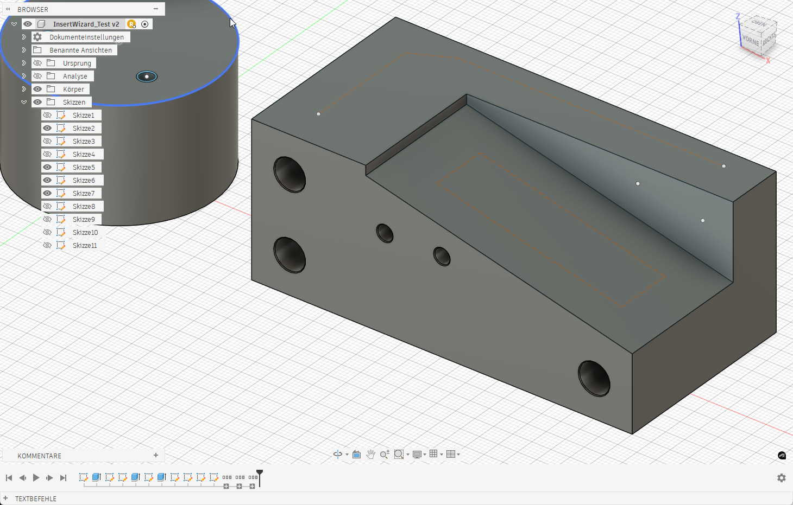
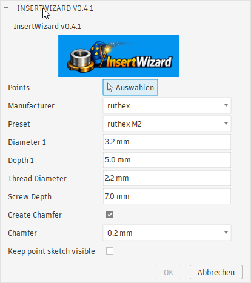

# InsertWizard ? Fusion 360 Helfer f?r Einschmelzgewinde

**Version 0.5.1** | [English](README.md) | Deutsch | [Versionshistorie](doku/version.md)

InsertWizard ist ein Fusion-360-Add-In, das pr?zise Bohrungen f?r Heat-Set Inserts aus Skizzenpunkten erzeugt. Preset w?hlen, Punkte ausw?hlen, und das Add-In erstellt die Schnitte (und optional Fasen).




## Funktionen
- Ein-Klick-Bohrungen aus Skizzenpunkten (Mehrfachauswahl m?glich).
- Preset-Bibliothek in `presets.json` (z. B. Ruthex, CNC Kitchen, 3D-Jake, ISO-Standards).
- Hersteller-Filter f?r Presets (Default M3 ist immer verf?gbar).
- Optionale Fase mit w?hlbarer Gr??e.
- Zus?tzliche Schraubenbohrung ?ber Gewinde-Durchmesser und Schrauben-Tiefe.
- Schrauben-Tiefe startet automatisch als `Tiefe 1 + int(Gewinde-Durchmesser)`.
- Schalter, um die Punkte-Skizze nach dem Ausf?hren sichtbar zu lassen.
- Parametrische Features bleiben in Fusion 360 editierbar.
- Automatische Benennung und Gruppierung pro Ausf?hrung.



## Benennung und Gruppierung

Jede Position erh?lt eigene Skizzen mit den Namen `<Manufacturer>_<Thread>-<N>-insert-sketch` und `<Manufacturer>_<Thread>-<N>-screw-sketch`. Die Punkteskizze bleibt unver?ndert; normale Verbindungslinien beeinflussen die Bohrungsprofile nicht.
- Jede erzeugte Extrusion wird benannt: `<Manufacturer>_<Thread>-<N>`
  - Beispiel: `ruthex_M3-1`
  - Leerzeichen im Gewinde werden entfernt (z. B. `M3 kurz` -> `M3kurz`).
- Alle in einem Lauf erzeugten Features (Extrusionen und Fasen) werden in der Timeline gruppiert.
  - Gruppenname: `group_<Manufacturer>_<Thread>-<N>`

## Presets-Datei
Die Presets werden aus `presets.json` im Add-In-Verzeichnis geladen. Eigene Presets k?nnen dort erg?nzt werden:

```json
{
  "presets": [
    {
      "Manufacturer": "ruthex",
      "Thread": "M3",
      "Diameter": 4.0,
      "Length": 5.7
    }
  ]
}
```

## Installation
1. Lade die aktuelle Release-ZIP herunter.
2. Entpacke den Ordner in dein Fusion-360-Add-Ins-Verzeichnis:
   - Windows: `%AppData%\Autodesk\Autodesk Fusion 360\API\AddIns`
   - macOS: `~/Library/Application Support/Autodesk/Autodesk Fusion 360/API/AddIns`
3. Starte Fusion 360.
4. ?ffne **Zusatzmodule** und starte **InsertWizard**.

## Bedienung
1. Erstelle eine Skizze und setze Punkte an die Einf?gepositionen.
2. Starte InsertWizard (Arbeitsbereich "Volumenkörper" -> Panel "Erstellen").
3. W?hle einen oder mehrere Skizzenpunkte (alle aus derselben Skizze).
4. W?hle ein Preset (z. B. `ruthex M3`).
5. W?hle Hersteller und Preset (Default M3 wird immer angezeigt).
6. Passe Durchmesser/Tiefe sowie Gewinde-Durchmesser/Schrauben-Tiefe an und waehle optional eine Fase.
7. Optional: Punkte-Skizze sichtbar lassen.
8. Best?tige mit **OK**.

## Lizenz
MIT-Lizenz - siehe `LICENSE`.

## Projekt unterst?tzen

Wenn du das Projekt unterst?tzen m?chtest, kannst du ?ber die [Amazon-Wunschliste](https://www.amazon.de/hz/wishlist/ls/LHL8DJWGYH8D?ref_=wl_share) einen Beitrag leisten.
