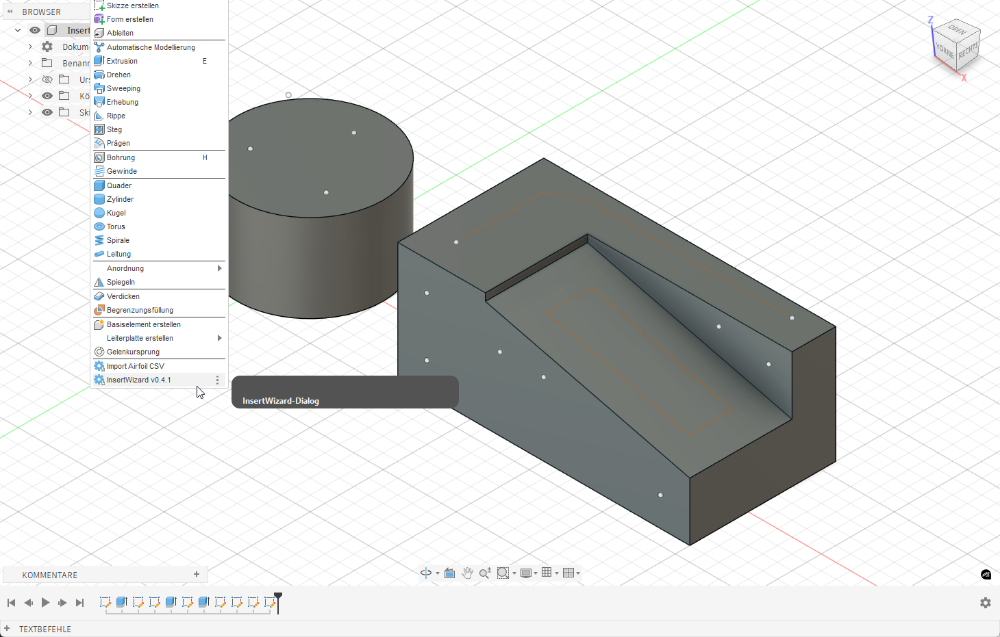
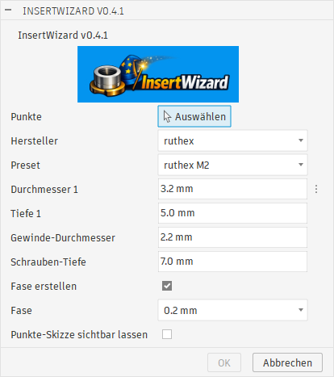
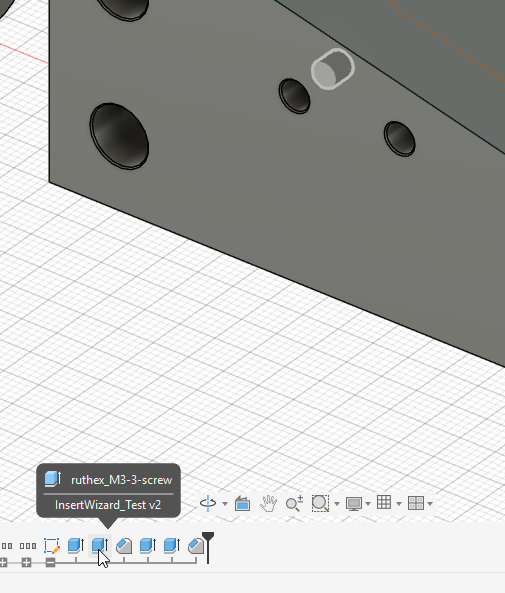
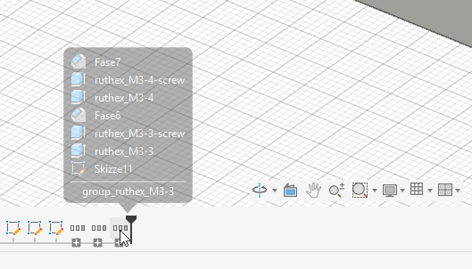

# Anleitung InsertWizard Ver. 0.4.1

## Installation

1. Lade die aktuelle Release-ZIP und entpacke sie.
2. Kopiere den Ordner `InsertWizard` in dein Fusion-Add-Ins-Verzeichnis:
   - Windows: `%AppData%\\Roaming\\Autodesk\\Autodesk Fusion 360\\API\\AddIns`
   - macOS: `~/Library/Application Support/Autodesk/Autodesk Fusion 360/API/AddIns`
3. Starte Fusion 360 neu.
4. Oeffne **Zusatzmodule** und aktiviere **InsertWizard**.

## Aufruf von InsertWizard

InsertWizard kann nach der Installation im folgenden Menue aufgerufen werden:

**Konstruktion / Volumenkoerper / Erstellen**

Nach dem Start des Add-ins wird das Dialogfenster von InsertWizard geoeffnet.

## Dialogfenster InsertWizard

Ueber den Button "Auswaehlen" werden die Punkte bzw. Skizzenelemente gewaehlt, an deren Position eine Bohrung fuer Einschmelz-Einsaetze erstellt werden soll.

Einstellungen im Dialog:
- Hersteller: filtert die Presets nach Hersteller.
- Preset: belegt Durchmesser 1 und Tiefe 1 mit den Vorgabewerten.
- Durchmesser 1 / Tiefe 1: Masse fuer den Einschmelz-Einsatz; koennen manuell angepasst werden.
- Gewinde-Durchmesser / Schrauben-Tiefe: Freibohrung fuer die Schraube; wird aus dem Preset bzw. aus einer Standardtabelle gesetzt und kann manuell ueberschrieben werden.
- Fase erstellen / Fase: erzeugt eine Fase mit definierter Groesse.
- Punkte-Skizze sichtbar lassen: laesst die Skizze mit den Punkten sichtbar.

### Mehrfachanwendung / Punkte-Skizze sichtbar lassen

- Aktiviere "Punkte-Skizze sichtbar lassen", damit die Skizze nach dem Ausfuehren sichtbar bleibt.
- So kannst du InsertWizard mehrfach nacheinander auf derselben Skizze anwenden, ohne die Skizze erneut einblenden zu muessen.
- Es werden nur Punkte aus derselben Skizze akzeptiert.

### Wichtige Hinweise

- Es koennen mehrere Punkte gewaehlt werden, aber nur aus derselben Skizze.
- Das Feld "Hersteller" filtert die Presets. "Default M3" wird immer angezeigt.
- Der Gewinde-Durchmesser wird aus dem Preset bzw. aus einer Standardtabelle gesetzt (z.B. M3=3.2 mm, M4=4.3 mm) und kann manuell ueberschrieben werden.
- Die Schrauben-Tiefe startet automatisch mit: `Tiefe 1 + int(Gewinde-Durchmesser)` und kann manuell angepasst werden.
- Zusaetzlich wird eine Schraubenbohrung um den Mittelpunkt erzeugt und um die Schrauben-Tiefe geschnitten.

## Konstruktions-Historie

In der Timeline werden die erzeugten Features zu einer Gruppe zusammengefasst und nach dem Preset benannt. Du kannst die Gruppe aufklappen und die einzelnen Extrusionen/Fasen weiterhin bearbeiten. So lassen sich nachtraeglich z.B. Durchmesser, Tiefe, Gewinde-Durchmesser oder Schrauben-Tiefe pro Feature anpassen. Aenderungen wirken nur auf das jeweilige Feature in der Gruppe.

## Fehlerbehebung

- Dialog erscheint nicht: Pruefe, ob das Add-in in **Zusatzmodule** aktiviert ist und ob der Ordner im richtigen Add-Ins-Verzeichnis liegt.
- Punkte lassen sich nicht waehlen: Es muessen Skizzenpunkte sein, und alle Punkte muessen aus derselben Skizze stammen.
- Presets fehlen oder sind leer: `presets.json` auf gueltiges JSON pruefen und die Add-in-Logs im Textfenster kontrollieren.
- Sprache stimmt nicht: Fusion neu starten oder in `InsertWizard/config.py` einen Override setzen.
- Schrauben-Tiefe/Gewinde-Durchmesser unplausibel: Werte im Dialog manuell anpassen.

## Spezielle Einstellungen

- Sprache folgt automatisch den Fusion-Voreinstellungen. Falls keine Uebersetzung vorhanden ist, wird Englisch verwendet.
- Optionaler Override in `InsertWizard/config.py`: `LANGUAGE = 'de' | 'en' | 'fr' | 'es' | 'it' | 'pl' | 'auto'`.
- Presets koennen in `InsertWizard/presets.json` angepasst oder erweitert werden.
